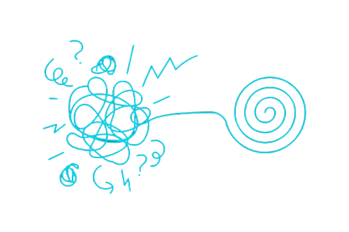

# Chaos Controlled Shifts Theory (CCS)

The Theory of Chaos Controlled Shifts builds upon established systems design principles to transform AI-human interaction through momentary, controlled disruptions in control dynamics. While control transitions themselves are not new, CCS suggests an innovative approach to AI-human collaboration.

This approach does not rely on randomness or handicapping but on intentional, context-sensitive interventions. By introducing controlled chaos at strategic moments, we may have discovered a key to optimizing AI-human interaction.

Key Points:

1. Builds on established systems principles
2. Implements controlled chaos in AI-human interaction
3. Enables new possibilities through strategic disruption
4. Transforms system dynamics through planned uncertainty

The innovation of CCS lies not in control transitions themselves, but in how controlled chaos reshapes AI-human interaction dynamics.

Main site for CCS, articles, discussion
